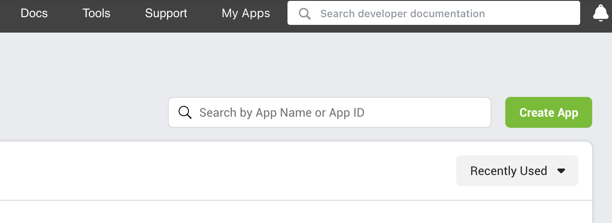
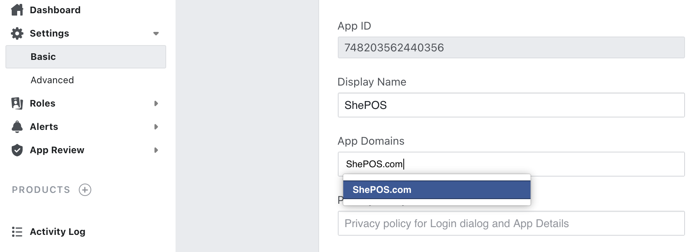
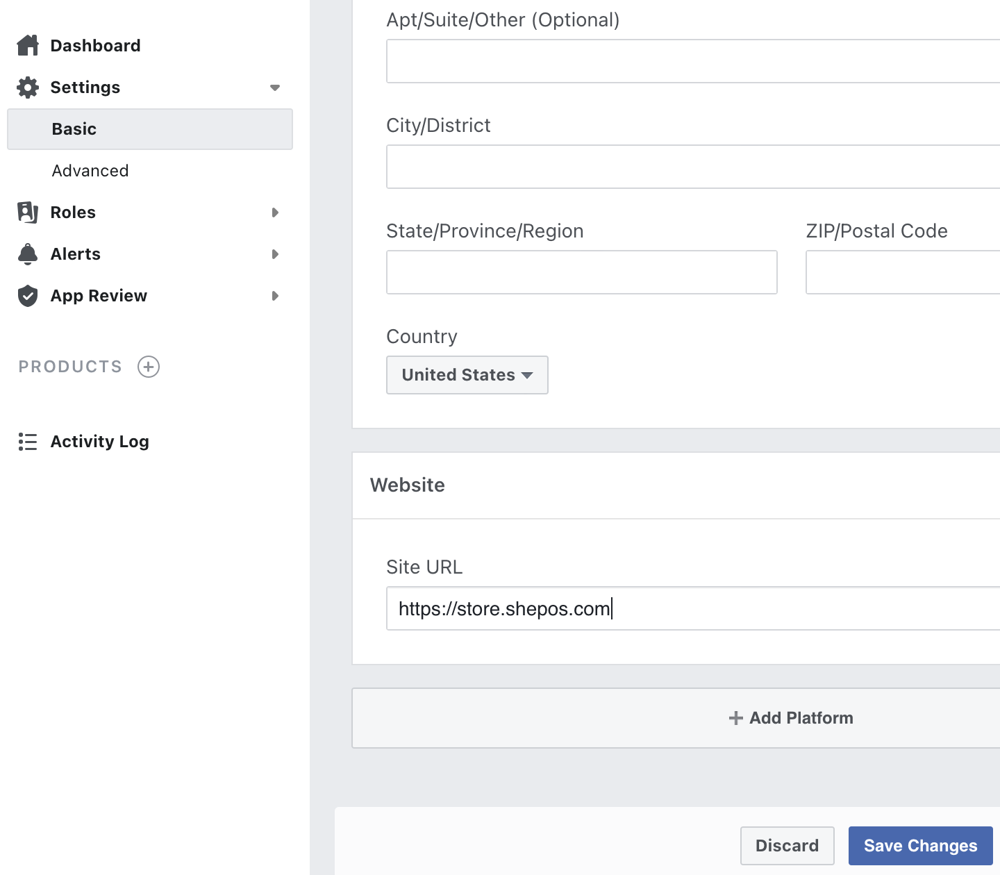
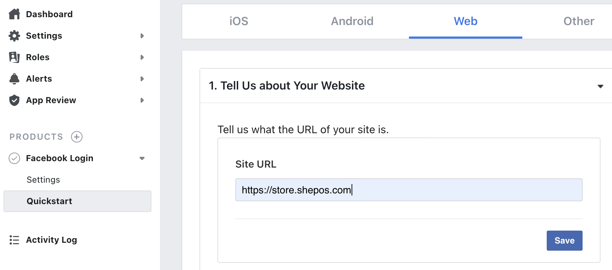
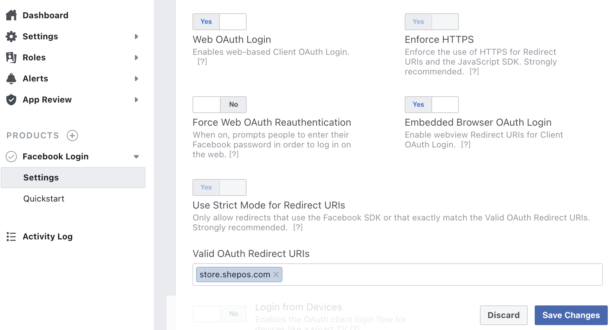

# Setup Facebook Login

Visit [https://developers.facebook.com/](https://developers.facebook.com/) and login to your Facebook account

On the top right corner, select "My Apps" and press "Create App"

Select "Manage Business Integrations", then click "Continue"

Fill out the form as follows:

* App Display Name: ShePOS
* App Contact Email: your email address
* App Purpose: Yourself or your own business

Click "Create App"

Complete the security check, then click "Submit"

On the app dashboard the left menu, select "Settings &gt; Basic". Enter your website domain into the "App Domains" field

Scroll down and press the "Add Platform" button, and select "Website"

Enter your ordering site URL into the "Site URL" box and then press "Save Changes" on the bottom right.

On the left navigation menu, press "Products" and scroll to the "Add Products to Your App" section.

Press the "Set Up" button for Facebook Login.

On the next screen, select "Web", you should see your "Site URL" already filled out, if not then you can enter it now, then press "Save"

On the left menu, under "Products &gt; Facebook Login", select "Settings"

Enable "Embedded Browser OAuth Login"

Enter your store domain into the "Valid OAuth Redirect URIs" field and press "Save Changes"

Finally, copy your Facebook App ID as shown on the top of the app dashboard

With the App ID copied, visit your restaurant dashboard and to "Settings &gt; System &gt; Customer Accounts &gt; Facebook". Paste your App ID and press save

Visit your online store and confirm that the Facebook login option is available under the "Login / Signup" popup

