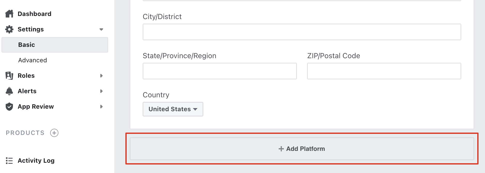
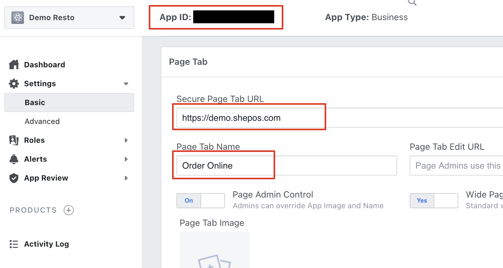

# Setup Facebook Ordering


As much as this feature sounds great, it's honestly not very pleasant for people to order through Facebook. These tabs are also only available in desktop versions of Facebook further limiting them. That means it won't work for users on their mobile phones. Facebook also regularly makes changes and sometimes things break unexpectedly. As such, overall we recommend against using this feature. Simply sending people to your ordering domain is a far more reliable option.


Visit [https://developers.facebook.com](https://developers.facebook.com). If you are not already signed into Facebook, you can sign in with your regular Facebook account.

Once done, select the "My Apps" button on the top right and select "Create App".

Enter your business name for your app name along with your email address and press create

After creating the app, you will be taken to the app dashboard. On the left menu, go to "Settings &gt; Basic", then scroll to the bottom and click "Add Platform"

Choose "Page Tab". You will now need to fill in your store URL under "Secure Page Tab URL" and what you want to call your page tab under "Page Tab Name". Your store URL can either be your SHEPOS subdomain such as "[https://your-resto.shepos.com](https://your-resto.shepos.com)" or your custom domain name if setup. When you are done, click "Save Changes".

To add the page tab to your Facebook page, you will need your Facebook App ID which you will see highlighted in orange in the previous photo at the top of the page

Next, you need to visit the following URL in your browser, while making sure to replace YOURAPPID with your Facebook app ID, and YOURSTOREURL with the store URL that you entered previously

[https://www.facebook.com/dialog/pagetab?app\_id=YOURAPPID&redirect\_uri=YOURSTOREURL](https://www.facebook.com/dialog/pagetab?app_id=YOURAPPID&redirect_uri=YOURSTOREURL)

If done correctly, you will see a page on Facebook saying "Add Page Tab" and you will be able to select one of your Facebook pages

